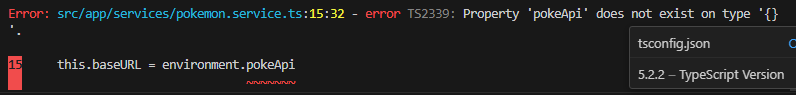
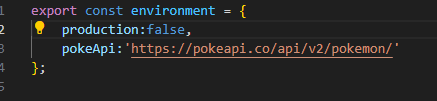

# Configuração para criar um service

- npm install -g @angular/cli
- Set-ExecutionPolicy -Scope CurrentUser -ExecutionPolicy RemoteSigned

ng new services-angular

code .

deletar arquivos spcs

limpar a tela de app.component.html

# Orgnaizar as pastas para criar um service

criar uma pasta components
criar uma pasta services

# Deixando os arquivos o mais limpo para entendimento

Alteração no arquivo app.component.html retiramos router e passamos como template app.component.ts, isso é uma maneira de organizar o projeto.

Criamos então um component cards 

ng g c components/card

# Para treinar as single page application vamos criar os cards do Pokemon 

# Conhecendo a [PokéApi](https://pokeapi.co/api/v2/pokemon/pikachu)

# O Ideal nos componentes é só ter regras de renderização

No angular recente gerar o enviroments
# ng generate environments

ng g s services/pokemonService

# Designer Patterns com angular Observable

Observable --> Lembra uma Promise

rxjs --> biblioteca 

# Erro com o @cli16 ? 

Precisei definir os dois arquivos environment(s)

O ideal para retornar um observable com o type corretamente descrito no model caso contrário tenho que retornar um type | any

Lembrar de importar FormsModule no app.module.ts

